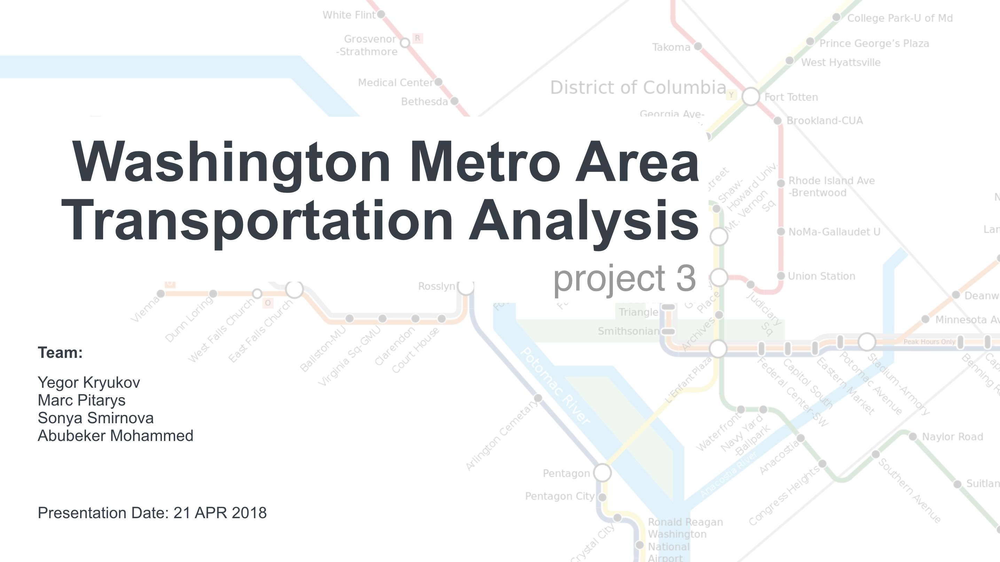
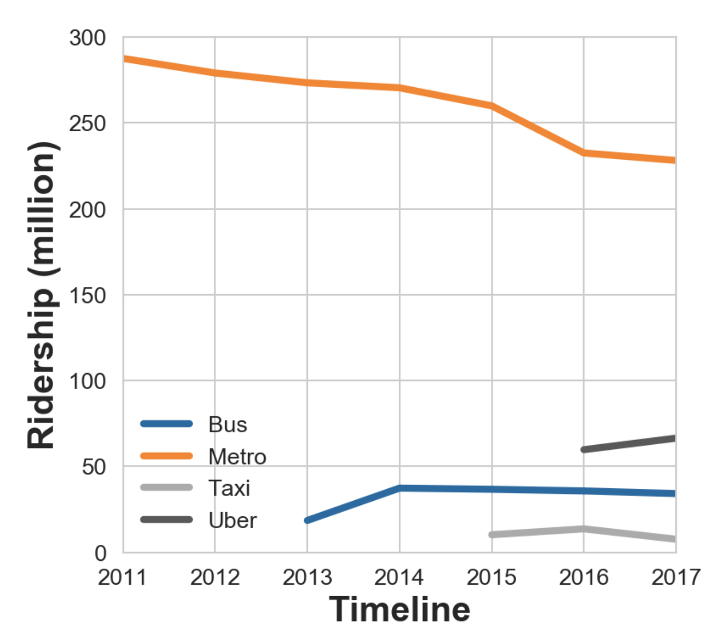
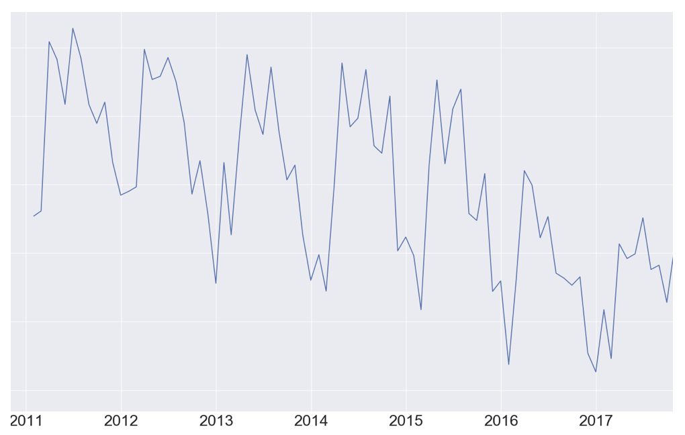
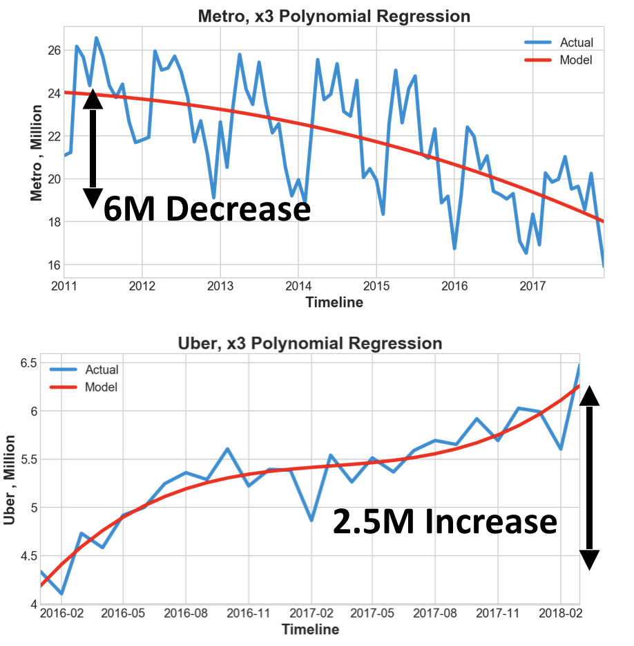
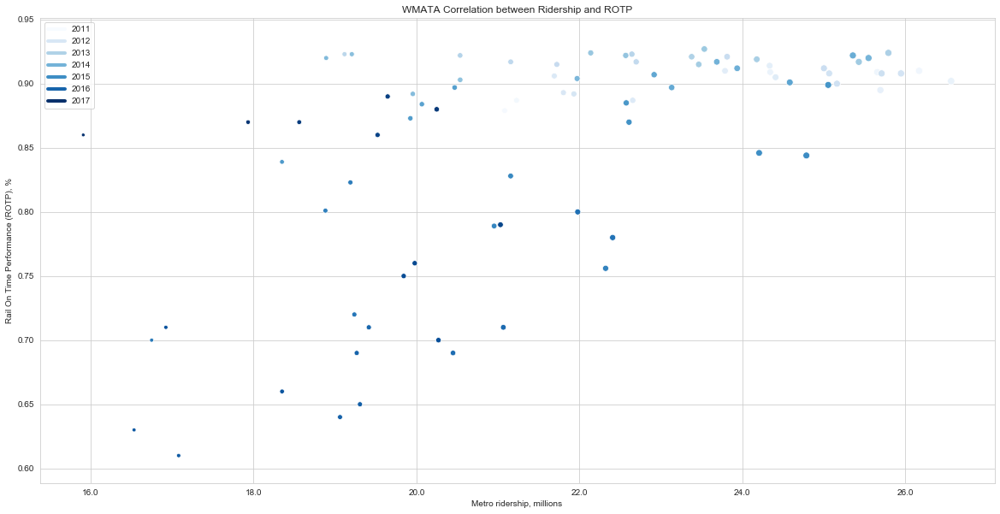

# Washington Metro Area Transportation Analysis

## Summary

The **Washington Metropolitan Transit Authority (WMATA)** provides bus and rail transit to the Washington region. Transporting over **300,000,000** passengers a year WMATA is facing many challenges concerning safety, ridership, and funding.

Metro ridership is declining over the years (see **Figure 1.**).  The goal of this study is to try to understand why is that happening.  Specifically to answer these questions:

1. What factors impact Metro performance?
2. Does Metro performance impact other transportation resources?

### Outcome

- Metro ridership loosing customers to other means of transportation even though economy is strong, and government employees get 100% refunds for rides
- Current metro KPIs are not significant factors in ridership numbers, WMATA needs to come up with better indicators

Figure 1. Ridership over years

---

## Data

What data is available? WMATA provides live data of vehicle locations over its API. Historical data for taxi and Uber is also available.

---

## Stats

Does time of year impact demand for transportation resources? **Yes.**

Figure 2. Seasonality

The graph of the ridership data shows strong:

1. Long-term downward trend
2. Long-Term cyclical seasonal movement with more rides over summers compared to winters

---
Does Metro performance impact the demand for other transportation resources? **Maybe.**

Metro lost more passengers (6M) than Uber gained (2.5M). Those passengers started using other modes of transportation that we didn't find the data for (e.g. personal vehicles).

Figure 3. Metro lost passengers to other players apart from Uber

---

Can we predict the availability of transportation resources based on metro past performance? **No.**

WMATA established a set of Key Performance Indicators (KPIs) to [monitor its performance](https://wmata.com/about/records/scorecard/upload/Q3FY18-Metro-Performance-Report-Final.pdf). Some KPIs from the list are:

1. ROTP: Rail On Time Performance–how many trains stayed on schedule
2. Rail Reliability–number of trains in operation
3. Crime: number of crimes per million passengers

The biggest correlation with the ridership out of all KPIs is ROTP (Figure 4). ROTP measure how many trains arrived on time as a percentage of trains schedules within a period of time. In other words is the metro scheduled 10 trains ove an hours and all 10 traines arrived on time–the ROTP will be 100%.

But what that really means? Does it mean that if all the trains stayed on schedule, the ridership will increase? Not really. Let's imagine a situation in with Metro schedules 1 train per hour for a certain station. If that schedule is followed by all the trains over a month then ROTP would be 100%. Yay, big win. But how **long** a passenger had to wait at the station? How many passenger **were** waiting at the station during that hour? Answers to these questions seem to be better KPIs to track.

Figure 4. Metro ridership vs ROTP

---

## Team Members

- Yegor Kryukov (solution architecture, polynomial regression functions, bus data)
- Marc J. Pitarys (presentation, statistics and models, metro data)
- Sonya Smirnova (linear regression functions and plots, ride-sharing companies data)
- Abubeker Mohammed (idea, taxi data)

